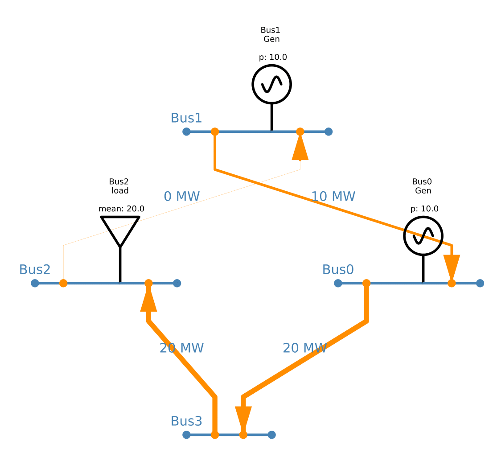

# PyPSA NetView - Visualize PyPSA networks
PyPSA NetView is build to visualize networks from the  power systems simulation framework.
PyPSA NetView automatically creates a visual representation of a given PyPSA network, showing buses, components on buses and links between buses. PyPSA NetView is very much in early development. 

PyPSA NetView can be installed with ```pip install pypsa_netview``` NOT YET

PyPSA NetView is built on the . 

Current limitations
------------
- By default, PyPSA NetView will create a circular layout with each bus being a point on a circle. Custom positioning is possible, but not implemented in a good way yet.

- PyPSA NetView can currently only visualize certain components on a bus. These are Loads, Generators and Stores. StorageUnits and the like are not supported yet.

- PyPSA NetView will always show the entire network. 

Input parameters
------------
The following parameters can be passed to draw_network:

- ```show_capcities = True```: If the network has been solved, show capacities for bus components and links

- ```filename = 'yourdrawing.pdf' ```: A drawing can be saved as pdf by passing a filename.
 
- ```spacing ```: Increase or decrease distance between buses for automatically generated bus positions
  
Code example
------------

The following code produces the example drawing with two buses:
```python
import pypsa
from pypsa_netview.draw import draw_network

n = pypsa.Network()

# Add buses, a bidirectional link, a load and a generator
n.madd('Bus',  ['Bus0', 'Bus1'])
n.add("Link", 'Link0', bus0 = 'Bus0', bus1 = 'Bus1', p_nom = 20, p_min_pu = -1,)
n.add("Load", 'Load0', bus = 'Bus0', p_set = 10)
n.add("Generator", 'Generator1', bus = 'Bus1', p_nom = 20)

# Solve the network (or not) and create visualization
n.lopf()
draw_network(n)
```

Dependencies
------------
- PyPSA 

- Schemdraw 

- Pandas 

- NumPy

Example drawings
------------
An exmaple of an unsolved two-bus network:


An example of a solved four-bus network:


